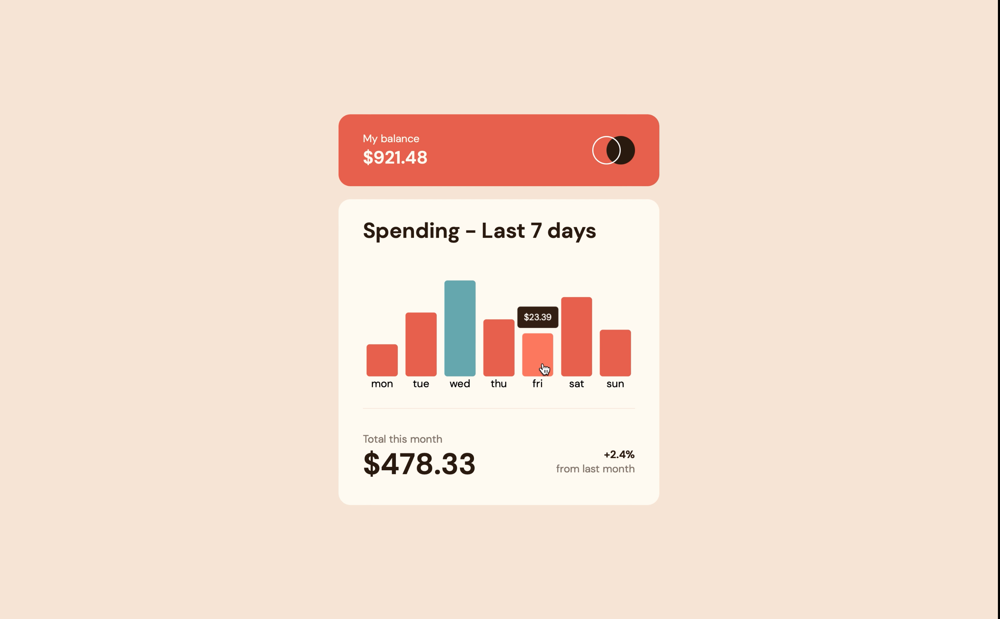

# This is my solution to challenge by FrontendMentor: Expenses Chart Component

### Screenshot

### Links

- Solution URL: https://github.com/martinideniam/project-5-expenses-chart-component
- Live Site URL: https://martinideniam.github.io/project-5-expenses-chart-component/

### Built with

- Semantic HTML5 markup
- CSS custom properties
- Flexbox
- CSS Grid
- Fetching, parsing JSON and dynamically updating values
